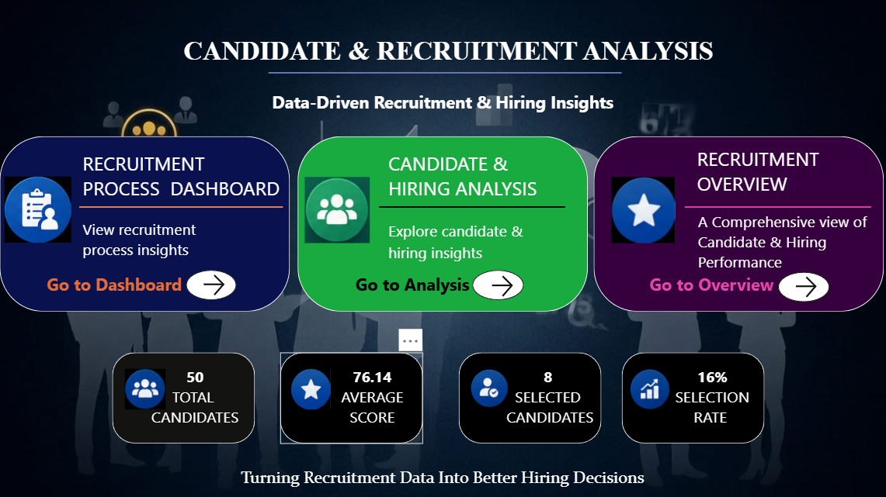

Recruitment Analytics Dashboard

📊 Project Overview

This project is an interactive Recruitment Analytics Dashboard developed using Microsoft Power BI to analyze recruitment data and provide meaningful insights into the hiring process.
The dashboard helps understand candidate status, vacancies, hiring progress, and overall recruitment performance through interactive visualizations and KPIs.

🛠️ Tools & Technologies
- Microsoft Power BI
- Microsoft Excel
- Data Cleaning
- Data Analysis
- Data Visualization
- KPI Reporting
- Business Intelligence

📌 Key Features
- Recruitment KPI analysis
- Candidate status analysis
- Vacancies vs. filled positions
- Hiring progress tracking
- Interactive charts and visualizations
- Recruitment performance analysis

📈 Dashboard Pages
1. Recruitment Process Dashboard
Provides an overview of recruitment activities, vacancies, candidates, and hiring status.
2. Candidate & Hiring Analysis
Analyzes candidate information and hiring outcomes to identify recruitment trends and patterns.
3. Recruitment Overview
Provides a consolidated view of important recruitment KPIs and insights.

🎯 Project Objective
The objective of this project is to transform recruitment data into an interactive dashboard that helps users monitor hiring performance and make data-driven decisions.

💡 Skills Demonstrated

- Data Analysis
- Data Cleaning
- Power BI Dashboard Development
- Data Visualization
- KPI Development
- Business Analytics
- Excel Data Handling

👤 Author
Shashikiran GM
Aspiring Data Analyst | MBA | SQL | Python | Excel | Power BI

## Dashboard Screenshots
### Recruitment Analytics Dashboard

### Candidate & Hiring Analysis

### Recruitment Overview

### Dashboard Home

# 📊 Dashboard Screenshots
### 1. Recruitment Analytics Overview

### 2. Recruitment Process Dashboard

### 3. Candidate & Hiring Analysis

### 4. Recruitment Insights

